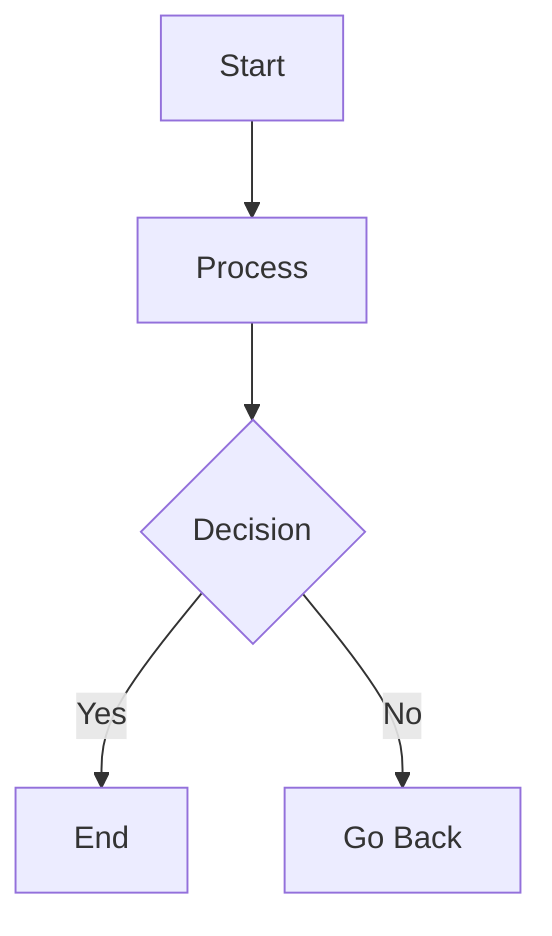
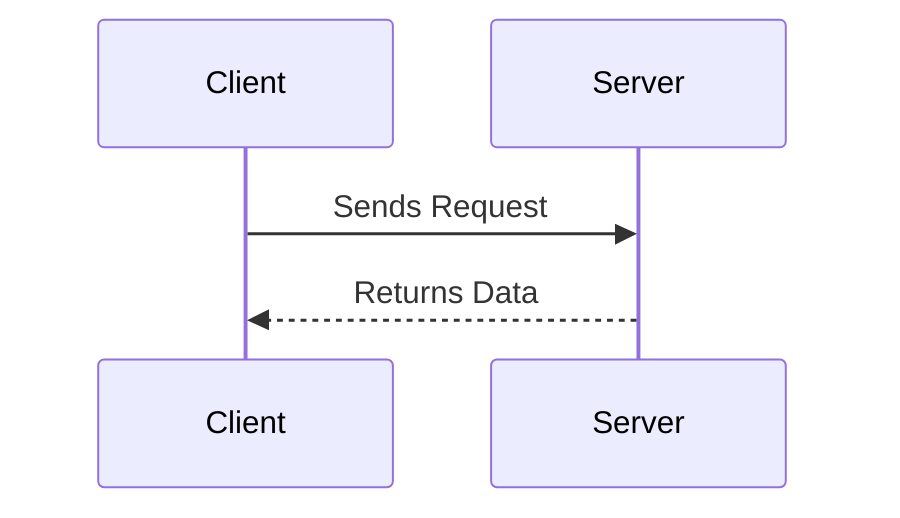
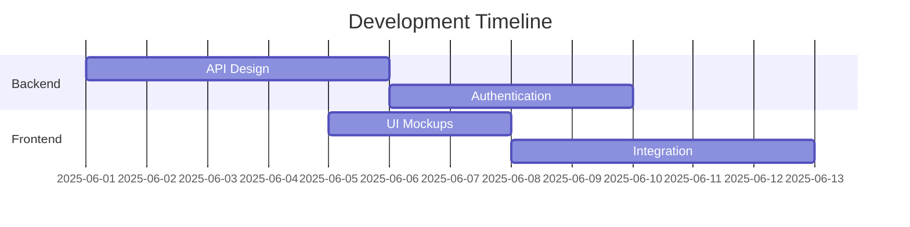

Documentation is most effective when it's both informative and visually engaging. That's where Mermaid.js comes in. Mermaid is a JavaScript-based diagramming and charting tool that turns plain text into beautiful visual diagrams. It integrates seamlessly with Markdown, making it a go-to solution for developers, project managers, and technical writers who want to include flowcharts, UML diagrams, Gantt charts, and more — without leaving their documentation workflow.

## What is Mermaid.js?

Mermaid lets you generate diagrams using a simple markdown-like syntax. Rather than manually drawing diagrams in tools like Figma or Visio, you write out your diagram logic in code — and Mermaid renders it dynamically.

Here's an example of a basic flowchart:



When rendered, this produces a neat directional flowchart — readable, responsive, and easily version-controlled.

## Getting Started

To use Mermaid in Markdown, your renderer or platform must support it. Some tools that natively support Mermaid include:

- VS Code (with extensions like Markdown Preview Mermaid Support)
- Obsidian (great for knowledge management)
- GitHub (in markdown files via markdown-mermaid integration)
- MkDocs with Mermaid plugin
- Docusaurus
- Jupyter Notebooks (with extensions)

For web projects, include Mermaid via CDN or npm and render diagrams directly in your HTML pages.

```html
<script type="module">
  import mermaid from 'https://cdn.jsdelivr.net/npm/mermaid@10/dist/mermaid.esm.min.mjs';
  mermaid.initialize({ startOnLoad: true });
</script>
```

## Diagram Types

Mermaid supports a wide range of diagram types:

- Flowcharts
- Sequence diagrams
- Class diagrams
- State diagrams
- Entity-Relationship diagrams (ERD)
- User Journey maps
- Gantt charts
- Pie charts and Quadrants

Each uses a different syntax. For example, a sequence diagram:



And a Gantt chart:



## Customization

You can style Mermaid diagrams using built-in themes (default, dark, neutral, and forest) or apply your own CSS. To change the theme globally:

```javascript
mermaid.initialize({
  theme: "dark"
});
```

You can also configure font size, arrow types, spacing, and more. This is especially useful for aligning diagrams with the look and feel of your documentation or brand.

## Live Editing & Preview

There are several online editors you can use to prototype and preview Mermaid diagrams quickly:

- Mermaid Live Editor
- StackEdit
- VS Code + Markdown Preview Enhanced extension

This allows you to test diagrams and export SVGs or PNGs for use in presentations or printed docs.

## Integration with Git & CI/CD

Mermaid's text-based syntax makes diagrams trackable in Git — unlike binary image files. You can diff diagram changes in pull requests, track updates, and even render them as part of your static site build process using tools like:

- MkDocs
- Jekyll
- Hugo
- Sphinx (Python)

Some CI/CD pipelines even generate and embed diagrams from .mmd files automatically.

## Additional Insights

To truly leverage Mermaid.js:

### Automate with Scripts
Use CLI tools to generate diagrams from .mmd files into SVG/PNG as part of your documentation build.

### Create Reusable Templates
Maintain a library of diagram templates for team use.

### Pair with Tools like Obsidian
For personal wikis or internal documentation, this pairing is powerful.

### Modularize
Break large diagrams into smaller, manageable pieces.

## Conclusion

Mermaid.js offers a powerful, flexible, and developer-friendly way to create diagrams using code. It enhances Markdown documentation by turning static text into dynamic visuals — all without leaving your coding environment. Whether you're a developer explaining architecture or a project lead mapping workflows, Mermaid saves time and brings clarity to your documents.